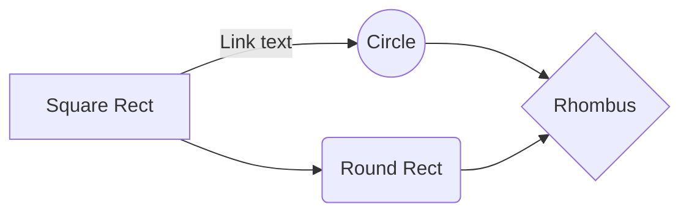

<div align="center">  </div>

___

# C - SIMPLE SHELL
The Simple Shell is a custom version of a UNIX-like command-line interpreter. It supports basic commands, executes programs, and interacts with the underlying system.


## Table of Contents

1. [Setup Instructions](#setup-instructions)
2. [Usage](#usage)
3. [Development Tools](#development-tools)
4. [Key Components](#key-components)
5. [Examples and Features](#examples-and-features)
6. [Visual Workflow](#visual-workflow)
7. [Additional Notes](#additional-notes)
8. [Contributor Guidelines](#contributor-guidelines)
9. [Contact](#contact)

## Setup Instructions

### Requirements

To use the Simple Shell, ensure you have:

-   A UNIX-like operating system (e.g., Linux, macOS).

-   GCC or another compatible C compiler.

-   Basic knowledge of the terminal and shell commands.

### Installation

1.  Clone the repository:
    ```
    git clone <Repository URL> 
    ```
2.  Navigate to the project directory:
    ```
    cd holbertonschool-simple_shell/
    ```
3.  Compile the source files:
    ```
    gcc -Wall -Werror -Wextra -pedantic -std=gnu89 *.c -o hsh
    ```
	
## Usage

1.  Run the shell:
    ```
    ./hsh
    ```
2.  The shell will display a prompt:
    ```
    #cisfun$
    ```
3.  Enter commands like `ls`, `pwd`, or `env`:
           
    -   **`pwd`**: Displays the full path of the current directory.
     
    -   **`ls`**: Lists directory contents.
    
    -   **`env`**: Displays environment variables.

## Development Tools

The project is implemented in C, leveraging the following libraries:

- `<stdio.h>`: For input/output operations (e.g., `printf`, `perror`).

- `<stdlib.h>`: For memory allocation and process termination (e.g., `malloc`, `free`, `exit`).

- `<string.h>`: For string manipulation (e.g., `strtok`, `strcmp`, `strlen`).

- `<unistd.h>`: For system calls (e.g., `execve`, `fork`, `isatty`).

- `<signal.h>`: For handling signals (e.g., `SIGINT`).

- `<dirent.h>`: For directory reading (e.g., `opendir`, `readdir`).

## Key Components


1.  ***get_user_input.c*** 
    
    -   Function: `get_user_input`
        
    -   Purpose: Reads and tokenizes user input.
        
    -   Key Points:
        
      	- Dynamically allocates memory.
            
        - Removes any trailing newline if present.
     
        - Handles EOF and invalid inputs.
            
2.  ***search_path.c*** 
    
    -   Functions: `search_dir`, `search_path`
        
    -   Purpose: Locates executables in the `PATH`.
        
    -   Key Points:
        
      	- Parses directories from the `PATH` environment variable.
            
        - Constructs and validates file paths.
            
3.  ***simple_shell.c*** 
    
    -   Functions: `main`, `execute`, `handle_sigint`, 
        
    -   Purpose: Core shell logic, command execution, and signal handling.
        
    -   Key Points:
        
        - Uses `fork` and `execve` to execute commands.
            
        - Handles `SIGINT` to gracefully ignore `Ctrl+C`.
        
        - Implements the `exit` built-in command.
 
 4. ***main.h***
    
    -   Purpose: Header file containing declarations and libraries for the shell.
        
    -   Key Points:
        
        - Provides function prototypes for `execute`, `get_user_input`, `search_dir`, and `search_path`.
            
        - Includes necessary libraries (`stdio.h`, `string.h`, `stdlib.h`, etc.).
        
       
## Examples and Features

The table below highlights some of the key features of the Simple Shell with corresponding examples.

|       **Feature**       | **Example Command** |                **Description**               | 
|:-----------------------:|:-------------------:|:--------------------------------------------:|
|      Run a Program      |       `ls -l`       |          Lists files in long format.         |  
|   Display Environment   |        `env`        |         Prints environment variables.        |   
|      Exit the Shell     |        `exit`       |         Terminates the shell session.        |   
|  Execute Absolute Path  |      `/bin/ls`      |    Runs a program using its absolute path.   |   
| Handle Invalid Commands |     `holberton`     |      Displays "Command not found" error.     |   
|     Signal Handling     |    Press `Ctrl+C`   | Gracefully ignores the signal and continues. | 

## Visual Workflow



## Additional Notes

1.  **Code Style**:
           
    -   Proper memory management practices are followed to avoid leaks.
        
    -   Edge cases like invalid commands and missing environment variables are handled gracefully.
    
    -   The code adheres to the Betty style guide for C programs.
    
    -   This project does not rely on external dependencies beyond standard C libraries, ensuring simplicity and portability.
        
4.  **Limitations**:
    
    -   Currently, the shell does not support advanced features like piping or redirection.
        
    -   Only basic built-in commands (`exit`, `env`) are supported.


## Contributor Guidelines

We welcome contributions! Here’s how :

1.  Fork the repository.
    
2.  Create a new branch:
    ```
    git checkout -b feature-branch
    ```
3.  Make your changes and commit:
    ```
    git commit -m "Add your feature"
    ```
4.  Push to your branch:
    ```
    git push origin feature-branch
    ```
5.  Submit a pull request.

## Contact

This README offers a thorough overview of the C - Simple Shell project and is ready for your use. Feel free to contact us regarding any issues or suggestions.

Anna Ly - https://github.com/aavly 

Lachie Duncan - https://github.com/lachied522

David Tangarife- https://github.com/Dstv1831
